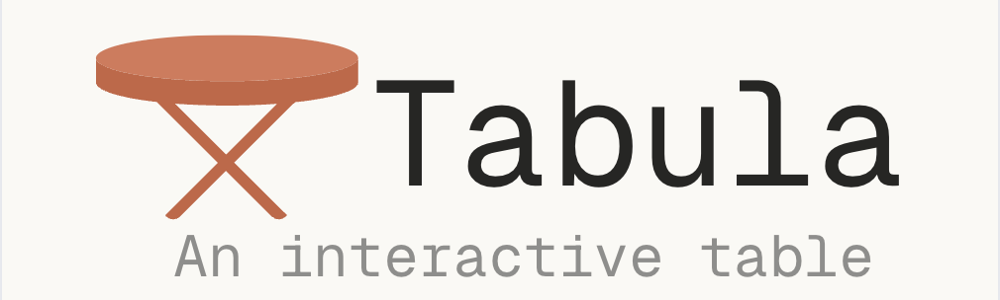

<p align="center">
  
</p>

# Tabula — An interactive table

**Tabula** is a lightweight, responsive table UI for browsing product data. It features sorting, filtering, search, and pagination — all built in React and TypeScript with a focus on clean UI and usability.

**Live demo**: [https://interactive-table-psi.vercel.app](https://interactive-table-psi.vercel.app)
**Data source**: [https://dummyjson.com/products](https://dummyjson.com/products)

## Features

* Sortable columns (single & multi-column)
* Dropdown-based filtering (e.g., by category)
* Keyword-based fuzzy search
* Basic pagination with next/prev navigation
* Light and dark mode with system preference detection
* Initial full-screen loader for aesthetic entry & perceived performance
* Reusable components using Tailwind + shadcn/ui

## Tech Stack

* **Framework**: React (with TypeScript)
* **Styling**: Tailwind CSS & shadcn/ui
* **Tooling**: Vite, ESLint, Prettier

## Project Structure

```
├── public/                  → Static assets
├── src/
│   ├── components/          → UI components (table, filters, loader)
│   ├── hooks/               → Custom hooks (fetch, theme, filters)
│   ├── lib/                 → Utilities and helpers
│   ├── types/               → Type definitions
│   └── App.tsx              → Root app logic
├── tailwind.config.ts       → Tailwind theme and config
└── vite.config.ts           → Vite setup
```

## Getting Started

```bash
git clone hhttps://github.com/Lionhearted1/interactive-table.git
cd tabula
npm install
npm run dev
```

## Potential Enhancements

* Handle offline/failed network state
* Add CSV export/download option
* Keyboard accessibility and ARIA improvements
* Improve responsiveness for small viewports

---

This project uses a static product dataset and performs sorting, filtering, and search operations entirely in the browser.
